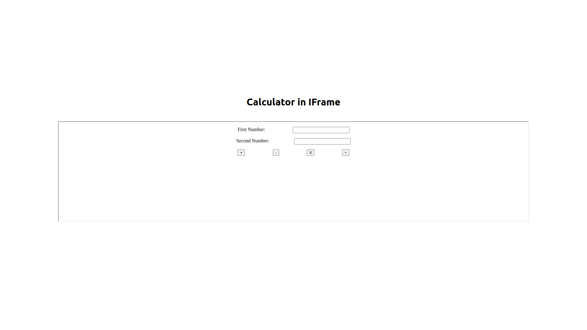
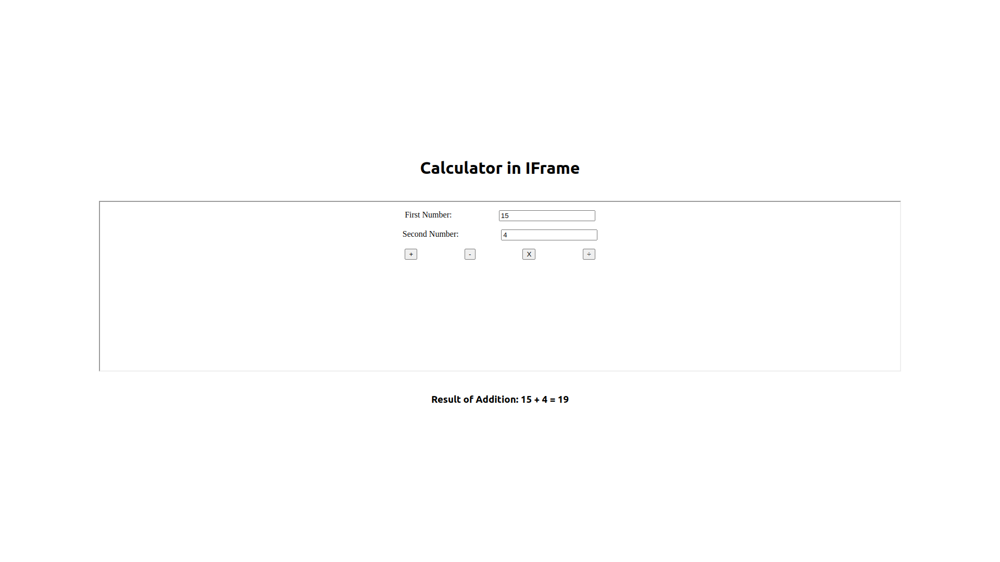
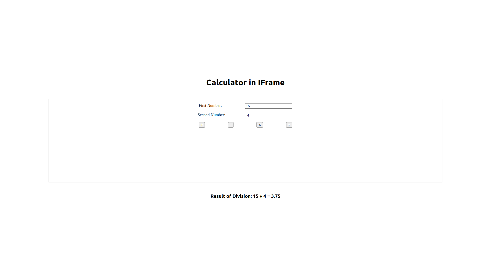

# Simple calculator in IFrame

Frontend ReactJS application to display a calculator inside a HTML IFrame, and to alert the output of the calculation to the main window. Performs Addition, Subtraction, Multiplication and Division. Built using create-react-app.

## Features

- Minimalistic Calculator
- Data transfer between React App and IFrame

## Demo

Here is a working live demo : https://github.com/hemanth-kumarv/iframe-calculator

### Landing Page

### Addition

### Division

## Setup

Clone this repo to your desktop and run `npm install` to install all the dependencies.
Once the dependencies are installed, you need to run `npm run start` to run the webapp. You might want to look into `package.json` to change the port.

## Usage

Once the dependencies are installed, you need to run `npm run start` to start the server.
You will then be able to access it at `localhost:3000`

## To-do

- Unit testing
- Enhanced UI/UX
- More functionalities/features
